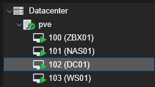
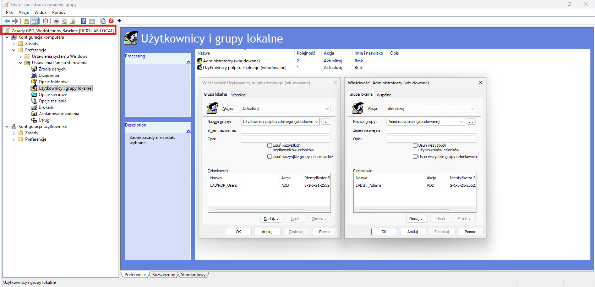
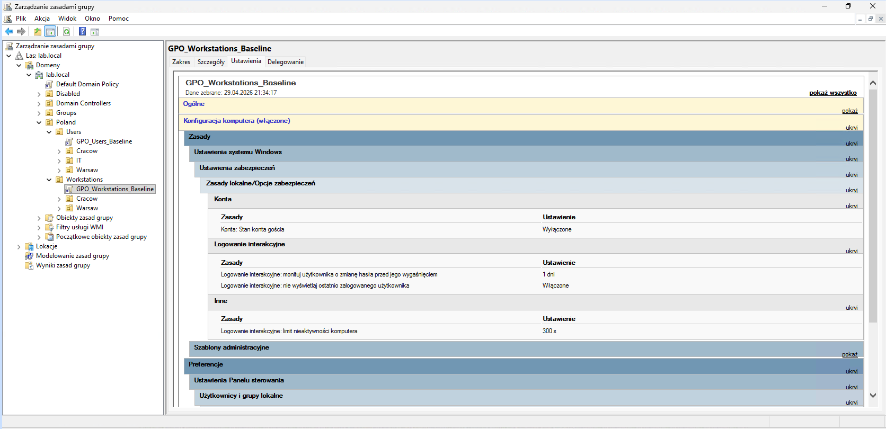
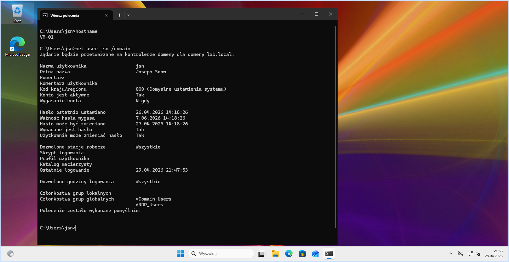
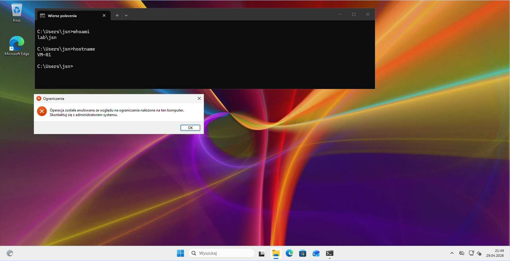

# homelab-active-directory-rdp

Active Directory lab demonstrating centralized RDP access using Group Policy and RBAC.

---

## Overview

- Centralized RDP access via GPO
- Role-Based Access Control (RBAC)
- No manual configuration on endpoints

---

## Architecture

- Proxmox (virtualization)
- DC01 – Windows Server (Domain Controller)
- WS01 – Windows 11 (client)

---

## RBAC Model

| Group            | Access                    |
|------------------|--------------------------|
| IT_Admins        | Local Administrators     |
| RDP_Users        | Remote Desktop access    |
| Accounting_Users | Department-level grouping|

---

## GPO Configuration

Centralized group assignment via GPO:

- `IT_Admins` → Local Administrators
- `RDP_Users` → Remote Desktop Users

---

## Security Baseline

- Guest account disabled
- Last logged-in user hidden
- Session timeout: 300 seconds

---

## Example Access

- IT Admin → `IT_Admins`, `RDP_Users`
- Accounting User → `Accounting_Users`, `RDP_Users`
- Standard User → `RDP_Users`

---

## Result

User gains RDP access via Active Directory group membership (`RDP_Users`) without any local configuration.

Access is restricted for unauthorized users by GPO.

Verified using:
- whoami
- hostname
- net user %username% /domain
